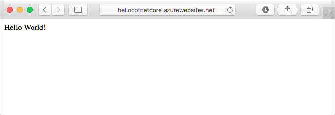
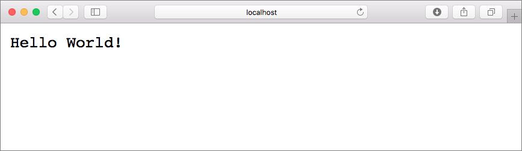
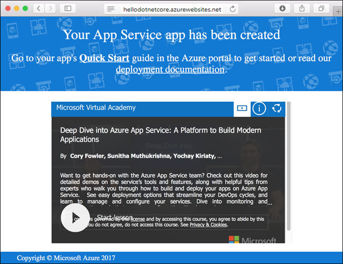
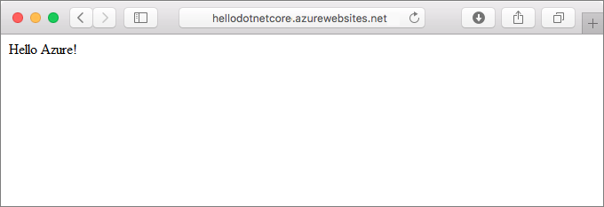

# Create a .NET Core web app in App Service on Linux

> [!NOTE]
> This article deploys an app to App Service on Linux. 
>

[App Service on Linux](app-service-linux-intro.md) provides a highly scalable, self-patching web hosting service using the Linux operating system. This quickstart shows how to create a [.NET Core](https://docs.microsoft.com/aspnet/core/) app on App Service on Linux. You create the web app using the [Azure CLI](https://docs.microsoft.com/cli/azure/get-started-with-azure-cli), and you use Git to deploy the .NET Core code to the web app.



You can follow the steps in this article using a Mac, Windows, or Linux machine.


## Prerequisites

To complete this quickstart:

* <a href="https://git-scm.com/" target="_blank">Install Git</a>
* <a href="https://www.microsoft.com/net/core/" target="_blank">Install .NET Core</a>

## Create the app locally

In a terminal window on your machine, create a directory named `hellodotnetcore` and change the current directory to it.

```bash
md hellodotnetcore
cd hellodotnetcore
```

Create a new .NET Core web app.

```bash
dotnet new web
```

## Run the app locally

Run the application locally so that you see how it should look when you deploy it to Azure. 

Restore the NuGet packages and run the app.

```bash
dotnet restore
dotnet run
```

Open a web browser, and navigate to the app at `http://localhost:5000`.

You see the **Hello World** message from the sample app displayed in the page.



In your terminal window, press **Ctrl+C** to exit the web server. Initialize a Git repository for the .NET Core project.

```bash
git init
git add .
git commit -m "first commit"
```

In the Cloud Shell, create deployment credentials with the [`az webapp deployment user set`](/cli/azure/webapp/deployment/user?view=azure-cli-latest#az_webapp_deployment_user_set) command. This deployment user is required for FTP and local Git deployment to a web app. The user name and password are account level. _They are different from your Azure subscription credentials._

In the following example, replace *\<username>* and *\<password>* (including brackets) with a new user name and password. The user name must be unique within Azure. The password must be at least eight characters long, with two of the following three elements: letters, numbers, symbols. 

>[!Note]
>Set up environment variables for use later. You will want to copy this block into a text editor and fill the variables out before pasting into cloud shell.


Navigate to https://shell.azure.com 

Azure Cloud Shell
```
RG=<Your assigned Resource Group for today>
LOCATION=southeastasia
DEPLUSER=mydeploymentuser
DEPLPWD=Pass@word1234
APPSVCPLAN=NikeWebAppPlan
APPNAME=azd-china-web-<first name, number, initials...something unique>
```


```azurecli-interactive
az webapp deployment user set --user-name $DEPLUSER --password $DEPLPWD
```

You should get a JSON output, with the password shown as `null`. If you get a `'Conflict'. Details: 409` error, change the username. If you get a ` 'Bad Request'. Details: 400` error, use a stronger password.

You create this deployment user only once; you can use it for all your Azure deployments.


## Create the Resource group

```
az group create --name $RG --location $LOCATION
```

You generally create your resource group and the resources in a region near you. 

When the command finishes, a JSON output shows you the resource group properties.

## Create the App Service Plan

```azurecli-interactive
az appservice plan create --name $APPSVCPLAN --resource-group $RG --sku B1 --is-linux --location $LOCATION
```

When the App Service plan has been created, the Azure CLI shows information similar to the following example:

```json
{ 
  "adminSiteName": null,
  "appServicePlanName": "myAppServicePlan",
  "geoRegion": "West Europe",
  "hostingEnvironmentProfile": null,
  "id": "/subscriptions/0000-0000/resourceGroups/myResourceGroup/providers/Microsoft.Web/serverfarms/myAppServicePlan",
  "kind": "linux",
  "location": "West Europe",
  "maximumNumberOfWorkers": 1,
  "name": "myAppServicePlan",
  < JSON data removed for brevity. >
  "targetWorkerSizeId": 0,
  "type": "Microsoft.Web/serverfarms",
  "workerTierName": null
} 
```

## Create a web app

```
az webapp create --resource-group $RG --plan $APPSVCPLAN --name $APPNAME --runtime "dotnetcore|2.0" --deployment-local-git
```

When the web app has been created, the Azure CLI shows output similar to the following example:

```json
Local git is configured with url of 'https://<username>@<app_name>.scm.azurewebsites.net/<app_name>.git'
{
  "availabilityState": "Normal",
  "clientAffinityEnabled": true,
  "clientCertEnabled": false,
  "cloningInfo": null,
  "containerSize": 0,
  "dailyMemoryTimeQuota": 0,
  "defaultHostName": "<app_name>.azurewebsites.net",
  "deploymentLocalGitUrl": "https://<username>@<app_name>.scm.azurewebsites.net/<app_name>.git",
  "enabled": true,
  < JSON data removed for brevity. >
}
```

You’ve created an empty web app in a Linux container, with git deployment enabled.

> [!NOTE]
> The URL of the Git remote is shown in the `deploymentLocalGitUrl` property, with the format `https://<username>@<app_name>.scm.azurewebsites.net/<app_name>.git`. Save this URL as you need it later.
>
> You may need to scroll up in the output to find your Git deployment URL
>

Browse to your newly created web app. Replace _&lt;app name>_ with your web app name.

You may need to wait a minute or two for the DNS name to register and the app to spin up.

```bash
http://<app name>.azurewebsites.net
```

Here is what your new web app should look like:




Back in the _local terminal window_, add an Azure remote to your local Git repository. Replace _&lt;deploymentLocalGitUrl-from-create-step>_ with the URL of the Git remote that you saved from [Create a web app](#create).

```bash
git remote add azure <deploymentLocalGitUrl-from-create-step>
```

Push to the Azure remote to deploy your app with the following command. When prompted for credentials by Git Credential Manager, make sure that you enter the credentials you created in the "Configure a deployment user" step, not the credentials you use to sign in to the Azure portal.

```bash
git push azure master
```

This command may take a few minutes to run. While running, it displays information similar to the following example:

```bash
Counting objects: 22, done.
Delta compression using up to 8 threads.
Compressing objects: 100% (18/18), done.
Writing objects: 100% (22/22), 51.21 KiB | 3.94 MiB/s, done.
Total 22 (delta 1), reused 0 (delta 0)
remote: Updating branch 'master'.
remote: Updating submodules.
remote: Preparing deployment for commit id '741f16d1db'.
remote: Generating deployment script.
remote: Project file path: ./hellodotnetcore.csproj
remote: Generated deployment script files
remote: Running deployment command...
remote: Handling ASP.NET Core Web Application deployment.
remote: ...............................................................................................
remote:   Restoring packages for /home/site/repository/hellodotnetcore.csproj...
remote: ....................................
remote:   Installing System.Xml.XPath 4.0.1.
remote:   Installing System.Diagnostics.Tracing 4.1.0.
remote:   Installing System.Threading.Tasks.Extensions 4.0.0.
remote:   Installing System.Reflection.Emit.ILGeneration 4.0.1.
remote:   ...
remote: Finished successfully.
remote: Running post deployment command(s)...
remote: Deployment successful.
To https://cephalin-dotnetcore.scm.azurewebsites.net/cephalin-dotnetcore.git
 * [new branch]      master -> master
```

## Browse to the app

Browse to the deployed application using your web browser.

```bash
http://<app_name>.azurewebsites.net
```

The .NET Core sample code is running in a web app with a built-in image.


**Congratulations!** You've deployed your first .NET Core app to App Service on Linux.

## Update and redeploy the code

In the local directory, open the _Startup.cs_ file. Make a small change to the text in the method call `context.Response.WriteAsync`:

```csharp
await context.Response.WriteAsync("Hello Azure!");
```

Commit your changes in Git, and then push the code changes to Azure.

```bash
git commit -am "updated output"
git push azure master
```

Once deployment has completed, switch back to the browser window that opened in the **Browse to the app** step, and hit refresh.



## Manage your new Azure web app

Go to the <a href="https://portal.azure.com" target="_blank">Azure portal</a> to manage the web app you created.

From the left menu, click **Resource Groups**. Find your Resource Group for todays labs.
You should see an App Service Plan and a Web App.
Click your WebApp.
You see your web app's Overview page. Here, you can perform basic management tasks like browse, stop, start, restart, and delete. 

