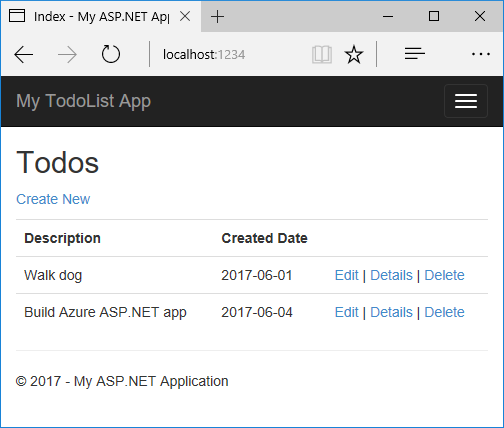
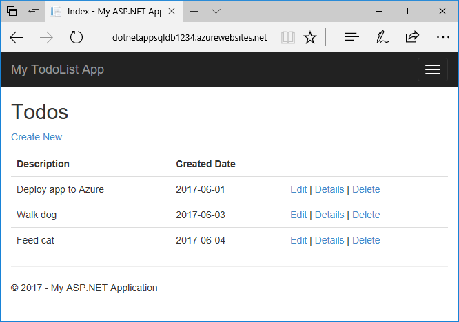
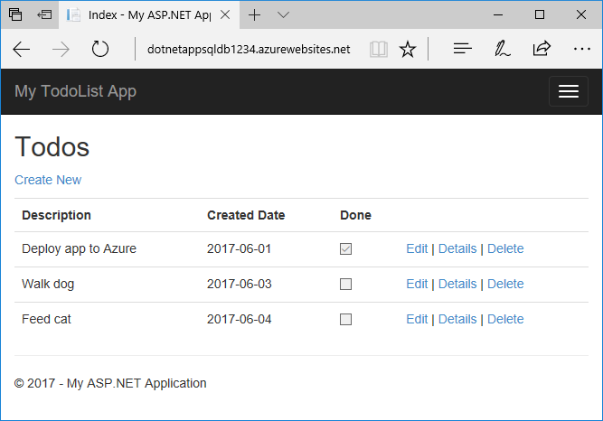

# Build a .NET Core and SQL Database web app in Azure App Service on Linux

> [!NOTE]
> This article deploys an app to App Service on Linux. 
>

[App Service on Linux] provides a highly scalable, self-patching web hosting service using the Linux operating system. This tutorial shows how to create a .NET Core web app and connect it to a SQL Database. When you're done, you'll have a .NET Core MVC app running in App Service on Linux.


What you learn how to:

> [!div class="checklist"]
> * Create a SQL Database in Azure
> * Connect a .NET Core app to SQL Database
> * Deploy the app to Azure
> * Update the data model and redeploy the app
> * Stream diagnostic logs from Azure
> * Manage the app in the Azure portal


## Prerequisites

To complete this tutorial:

* [Install Git](https://git-scm.com/)
* [Install .NET Core](https://www.microsoft.com/net/core/)

## Create local .NET Core app

In this step, you set up the local .NET Core project.

### Clone the sample application

In the terminal window, `cd` to a working directory.

Run the following commands to clone the sample repository and change to its root.

```bash
git clone https://github.com/azure-samples/dotnetcore-sqldb-tutorial
cd dotnetcore-sqldb-tutorial
```

The sample project contains a basic CRUD (create-read-update-delete) app using [Entity Framework Core](https://docs.microsoft.com/ef/core/).

### Run the application

Run the following commands to install the required packages, run database migrations, and start the application.

```bash
dotnet restore
dotnet ef database update
dotnet run
```

Navigate to `http://localhost:5000` in a browser. Select the **Create New** link and create a couple _to-do_ items.



To stop .NET Core at any time, press `Ctrl+C` in the terminal.

## Create variables for this lab

>[!Note]
>Set up environment variables for use later. You will want to copy this block into a text editor and fill the variables out before pasting into cloud shell.

```
RG=<Your assigned Resource Group for today>
LOCATION=southeastasia
DEPLUSER=<username from last lab>
DEPLPWD=<password from last lab>
APPSVCPLAN=<App Plan Name from last lab>
APPWEBSQLNAME=<New Web Name - eg: azd-china-websql-firstname>
SQLSERVER=<Azure SQL Server Name - eg: azd-china-sqlsrv-firstname>
SQLADM=<SQL Admin User - eg: sql-adm-user>
SQLPWD=<SQL Admin Password>
```

Navigate to https://shell.azure.com 
Once you have the 


## Create production SQL Database

In this step, you create a SQL Database in Azure. When your app is deployed to Azure, it uses this cloud database.


### Create a SQL Database logical server

In the Cloud Shell, create a SQL Database logical server with the [`az sql server create`](/cli/azure/sql/server?view=azure-cli-latest#az-sql-server-create) command.

This name is used as the part of the SQL Database endpoint, `<server_name>.database.windows.net`, so the name needs to be unique across all logical servers in Azure. The name must contain only lowercase letters, numbers, and the hyphen (-) character, and must be between 3 and 50 characters long. Also, replace *\<db_username>* and *\<db_password>* with a username and password of your choice. 


```azurecli-interactive
az sql server create --name $SQLSERVER --resource-group $RG --location $LOCATION --admin-user $SQLADM --admin-password $SQLPWD
```

When the SQL Database logical server is created, the Azure CLI shows information similar to the following example:

```json
{
  "administratorLogin": "sqladmin",
  "administratorLoginPassword": null,
  "fullyQualifiedDomainName": "<server_name>.database.windows.net",
  "id": "/subscriptions/00000000-0000-0000-0000-000000000000/resourceGroups/myResourceGroup/providers/Microsoft.Sql/servers/<server_name>",
  "identity": null,
  "kind": "v12.0",
  "location": "westeurope",
  "name": "<server_name>",
  "resourceGroup": "myResourceGroup",
  "state": "Ready",
  "tags": null,
  "type": "Microsoft.Sql/servers",
  "version": "12.0"
}
```

### Configure a server firewall rule

Create an [Azure SQL Database server-level firewall rule](../../sql-database/sql-database-firewall-configure.md) using the [`az sql server firewall create`](/cli/azure/sql/server/firewall-rule?view=azure-cli-latest#az-sql-server-firewall-rule-create) command. When both starting IP and end IP are set to 0.0.0.0, the firewall is only opened for other Azure resources. 

```azurecli-interactive
az sql server firewall-rule create --resource-group $RG --server $SQLSERVER --name AllowYourIp --start-ip-address 0.0.0.0 --end-ip-address 0.0.0.0
```

### Create a database

Create a database with an [S0 performance level](../../sql-database/sql-database-service-tiers-dtu.md) in the server using the [`az sql db create`](/cli/azure/sql/db?view=azure-cli-latest#az-sql-db-create) command.

```azurecli-interactive
az sql db create --resource-group $RG --server $SQLSERVER --name coreDB --service-objective S0
```

### Create connection string

Replace the following string with the *\<server_name>*, *\<db_username>*, and *\<db_password>* you used earlier.

>>[!NOTE]*You will need to paste in the actual values, not variabile names. Copy the line below into a text editor and vill the values out for later.*

```
Server=tcp:<server_name>.database.windows.net,1433;Database=coreDB;User ID=<db_username>;Password=<db_password>;Encrypt=true;Connection Timeout=30;
```

This is the connection string for your .NET Core app. Copy it for use later.

## Deploy app to Azure

In this step, you deploy your SQL Database-connected .NET Core application to App Service on Linux. We will re-use some of the components from the last lab.


### Create a web app

```
az webapp create --resource-group $RG --plan $APPSVCPLAN --name $APPWEBSQLNAME --runtime "dotnetcore|2.0" --deployment-local-git
```

> [!NOTE]
> The URL of the Git remote is shown in the `deploymentLocalGitUrl` property, with the format `https://<username>@<app_name>.scm.azurewebsites.net/<app_name>.git`. Save this URL as you need it later.
>
> You may need to scroll up in the output to find your Git deployment URL
>

### Configure an environment variable

To set connection strings for your Azure app, use the [`az webapp config appsettings set`](/cli/azure/webapp/config/appsettings?view=azure-cli-latest#az-webapp-config-appsettings-set) command in the Cloud Shell. In the following command, replace the *\<connection_string>* parameter with the connection string you created earlier.

```azurecli-interactive
az webapp config connection-string set --resource-group $RG --name $APPWEBSQLNAME --settings MyDbConnection='<connection_string>' --connection-string-type SQLServer
```

Next, set `ASPNETCORE_ENVIRONMENT` app setting to _Production_. This setting lets you know whether you are running in Azure, because you use SQLite for your local development environment and SQL Database for your Azure environment.

The following example configures a `ASPNETCORE_ENVIRONMENT` app setting in your Azure web app. Replace the *\<app_name>* placeholder.

```azurecli-interactive
az webapp config appsettings set --name $APPWEBSQLNAME --resource-group $RG --settings ASPNETCORE_ENVIRONMENT="Production"
```

### Connect to SQL Database in production

In your local repository, open Startup.cs and find the following code:

```csharp
services.AddDbContext<MyDatabaseContext>(options =>
        options.UseSqlite("Data Source=localdatabase.db"));
```

Replace it with the following code, which uses the environment variables that you configured earlier.

```csharp
// Use SQL Database if in Azure, otherwise, use SQLite
if(Environment.GetEnvironmentVariable("ASPNETCORE_ENVIRONMENT") == "Production")
    services.AddDbContext<MyDatabaseContext>(options =>
            options.UseSqlServer(Configuration.GetConnectionString("MyDbConnection")));
else
    services.AddDbContext<MyDatabaseContext>(options =>
            options.UseSqlite("Data Source=MvcMovie.db"));

// Automatically perform database migration
services.BuildServiceProvider().GetService<MyDatabaseContext>().Database.Migrate();
```

If this code detects that it is running in production (which indicates the Azure environment), then it uses the connection string you configured to connect to the SQL Database.

The `Database.Migrate()` call helps you when it is run in Azure, because it automatically creates the databases that your .NET Core app needs, based on its migration configuration. 

Save your changes, then commit it into your Git repository. 

```bash
git add .
git commit -m "connect to SQLDB in Azure"
```

### Push to Azure from Git

Back in the _local terminal window_, add an Azure remote to your local Git repository. Replace _&lt;deploymentLocalGitUrl-from-create-step>_ with the URL of the Git remote that you saved from [Create a web app](#create).

```bash
git remote add azure <deploymentLocalGitUrl-from-above-create-step>
```

Push to the Azure remote to deploy your app with the following command. When prompted for credentials by Git Credential Manager, make sure that you enter the credentials you created in [Configure a deployment user](#configure-a-deployment-user), not the credentials you use to sign in to the Azure portal.

```bash
git push azure master
```
Enter the Deployment User Password you created earlier when prompted.

This command may take a few minutes to run. While running, it displays information similar to the following example:

```bash
Counting objects: 98, done.
Delta compression using up to 8 threads.
Compressing objects: 100% (92/92), done.
Writing objects: 100% (98/98), 524.98 KiB | 5.58 MiB/s, done.
Total 98 (delta 8), reused 0 (delta 0)
remote: Updating branch 'master'.
remote: .
remote: Updating submodules.
remote: Preparing deployment for commit id '0c497633b8'.
remote: Generating deployment script.
remote: Project file path: ./DotNetCoreSqlDb.csproj
remote: Generated deployment script files
remote: Running deployment command...
remote: Handling ASP.NET Core Web Application deployment.
remote: .
remote: .
remote: .
remote: Finished successfully.
remote: Running post deployment command(s)...
remote: Deployment successful.
remote: App container will begin restart within 10 seconds.
To https://<app_name>.scm.azurewebsites.net/<app_name>.git
 * [new branch]      master -> master
```

### Browse to the Azure web app

Browse to the deployed web app using your web browser.

```bash
http://<app_name>.azurewebsites.net
```

Add a few to-do items.



**Congratulations!** You're running a data-driven .NET Core app in App Service on Linux.

## Update locally and redeploy

In this step, you make a change to your database schema and publish it to Azure.

### Update your data model

Open _Models\Todo.cs_ in the code editor. Add the following property to the `ToDo` class:

```csharp
public bool Done { get; set; }
```

### Run Code First Migrations locally

Run a few commands to make updates to your local database.

```bash
dotnet ef migrations add AddProperty
```

Update the local database:

```bash
dotnet ef database update
```

### Use the new property

Make some changes in your code to use the `Done` property. For simplicity in this tutorial, you're only going to change the `Index` and `Create` views to see the property in action.

Open _Controllers\TodosController.cs_.

Find the `Create()` method and add `Done` to the list of properties in the `Bind` attribute. When you're done, your `Create()` method signature looks like the following code:

```csharp
public async Task<IActionResult> Create([Bind("ID,Description,CreatedDate,Done")] Todo todo)
```

Open _Views\Todos\Create.cshtml_.

In the Razor code, you should see a `<div class="form-group">` element for `Description`, and then another `<div class="form-group">` element for `CreatedDate`. Immediately following these two elements, add another `<div class="form-group">` element for `Done`:

```csharp
<div class="form-group">
    <label asp-for="Done" class="col-md-2 control-label"></label>
    <div class="col-md-10">
        <input asp-for="Done" class="form-control" />
        <span asp-validation-for="Done" class="text-danger"></span>
    </div>
</div>
```

Open _Views\Todos\Index.cshtml_.

Search for the empty `<th></th>` element. Just above this element, add the following Razor code:

```csharp
<th>
    @Html.DisplayNameFor(model => model.Done)
</th>
```

Find the `<td>` element that contains the `asp-action` tag helpers. Just above this element, add the following Razor code:

```csharp
<td>
    @Html.DisplayFor(modelItem => item.CreatedDate)
</td>
```

That's all you need to see the changes in the `Index` and `Create` views.

### Test your changes locally

Run the app locally.

```bash
dotnet run
```

In your browser, navigate to `http://localhost:5000/`. You can now add a to-do item and check **Done**. Then it should show up in your homepage as a completed item. Remember that the `Edit` view doesn't show the `Done` field, because you didn't change the `Edit` view.

### Publish changes to Azure

```bash
git add .
git commit -m "added done field"
git push azure master
```

Once the `git push` is complete, navigate to your Azure web app and try out the new functionality.



All your existing to-do items are still displayed. When you republish your .NET Core app, existing data in your SQL Database is not lost. Also, Entity Framework Core Migrations only changes the data schema and leaves your existing data intact.

